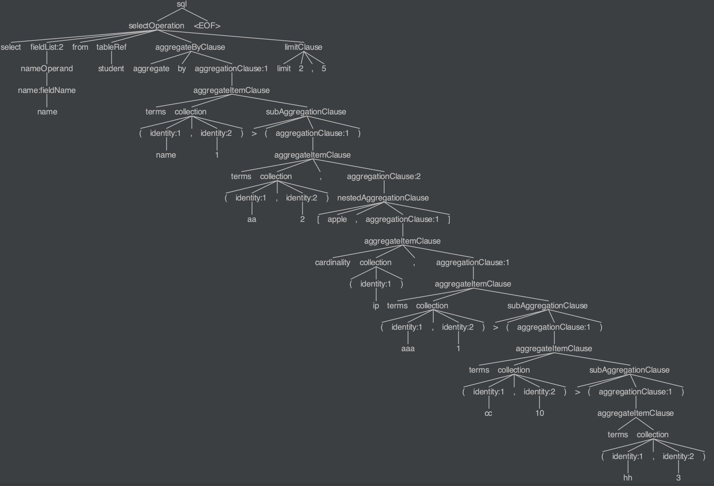
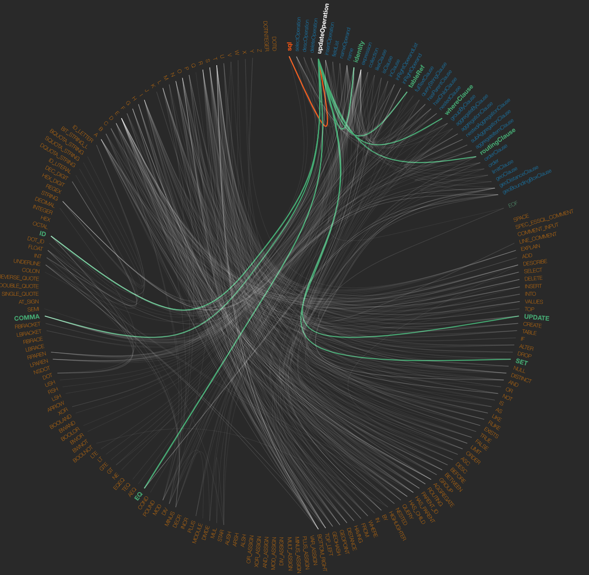

Elasticsearch-SQL
-----------------

## Build status
**6.0.0** [](https://travis-ci.org/iamazy/elasticsearch-sql)
**6.0.1** [](https://travis-ci.org/iamazy/elasticsearch-sql)
**6.1.0** [](https://travis-ci.org/iamazy/elasticsearch-sql)
**6.1.1** [](https://travis-ci.org/iamazy/elasticsearch-sql)
**6.1.2** [](https://travis-ci.org/iamazy/elasticsearch-sql)
**6.1.3** [](https://travis-ci.org/iamazy/elasticsearch-sql)<br/>
**6.1.4** [](https://travis-ci.org/iamazy/elasticsearch-sql)
**6.2.0** [](https://travis-ci.org/iamazy/elasticsearch-sql)
**6.2.1** [](https://travis-ci.org/iamazy/elasticsearch-sql)
**6.2.2** [](https://travis-ci.org/iamazy/elasticsearch-sql)
**6.2.3** [](https://travis-ci.org/iamazy/elasticsearch-sql)
**6.2.4** [](https://travis-ci.org/iamazy/elasticsearch-sql)<br/>
**6.3.0** [](https://travis-ci.org/iamazy/elasticsearch-sql)
**6.3.1** [](https://travis-ci.org/iamazy/elasticsearch-sql)
**6.3.2** [](https://travis-ci.org/iamazy/elasticsearch-sql)
**6.4.0** [](https://travis-ci.org/iamazy/elasticsearch-sql)
**6.4.1** [](https://travis-ci.org/iamazy/elasticsearch-sql)
**6.4.2** [](https://travis-ci.org/iamazy/elasticsearch-sql)<br/>
**6.4.3** [](https://travis-ci.org/iamazy/elasticsearch-sql)
**6.5.0** [](https://travis-ci.org/iamazy/elasticsearch-sql)
**6.5.1** [](https://travis-ci.org/iamazy/elasticsearch-sql)
**6.5.2** [](https://travis-ci.org/iamazy/elasticsearch-sql)
**6.5.3** [](https://travis-ci.org/iamazy/elasticsearch-sql)
**6.5.4** [](https://travis-ci.org/iamazy/elasticsearch-sql)<br/>
**6.6.0** [](https://travis-ci.org/iamazy/elasticsearch-sql)
**6.6.1** [](https://travis-ci.org/iamazy/elasticsearch-sql)
**6.6.2** [](https://travis-ci.org/iamazy/elasticsearch-sql)
**6.7.0** [](https://travis-ci.org/iamazy/elasticsearch-sql)
**6.7.1** [](https://travis-ci.org/iamazy/elasticsearch-sql)
**6.7.2** [](https://travis-ci.org/iamazy/elasticsearch-sql)<br/>
**6.8.0** [](https://travis-ci.org/iamazy/elasticsearch-sql)
**6.8.1** [](https://travis-ci.org/iamazy/elasticsearch-sql)
**6.8.2** [](https://travis-ci.org/iamazy/elasticsearch-sql)
**7.0.0** [](https://travis-ci.org/iamazy/elasticsearch-sql)
**7.0.1** [](https://travis-ci.org/iamazy/elasticsearch-sql)
**7.1.0** [](https://travis-ci.org/iamazy/elasticsearch-sql)<br/>
**7.1.1** [](https://travis-ci.org/iamazy/elasticsearch-sql)
**7.2.0** [](https://travis-ci.org/iamazy/elasticsearch-sql)
**7.2.1** [](https://travis-ci.org/iamazy/elasticsearch-sql)
**7.3.0** [](https://travis-ci.org/iamazy/elasticsearch-sql)
**7.3.1** [](https://travis-ci.org/iamazy/elasticsearch-sql)
**7.3.2** [](https://travis-ci.org/iamazy/elasticsearch-sql)

## Description
rewrite [elasticsearch-sql2](https://github.com/iamazy/elasticsearch-sql2) with **antlr4**

## Changelog
[Changelog](https://github.com/iamazy/elasticsearch-sql/blob/master/CHANGELOG)

## Maven
```xml
<dependency>
    <groupId>io.github.iamazy.elasticsearch.dsl</groupId>
    <artifactId>elasticsearch-sql</artifactId>
    <version>7.3.2.3</version>
</dependency>
```

## Plugin(isql)
#### Version

| elasticsearch version | latest version | remark | isql version | 
| ---- | ---- | ---- | ---- | 
| 7.x | 7.3.1 | | v7.3.1.3 |
| 7.x | 7.3.2 | | v7.3.2.2 |

#### Installing

Elasticsearch {7.x}
```
./bin/elasticsearch-plugin install https://github.com/iamazy/elasticsearch-sql/releases/download/{isql-version}/elasticsearch-sql-plugin-{isql-version}.zip
```

#### Usage

##### 1. query dataset with sql
```
POST _isql
{
    "sql":"select * from fruit"
}
```
##### 2. parse sql into elasticsearch dsl
```
POST _isql/_explain
{
    "sql":"select * from fruit"
}
```

## Wiki
[elasticsearch-sql-wiki](https://github.com/iamazy/elasticsearch-sql/wiki)

## Features
#### 1. Based on antlr4
> customize grammer of elasticsearch sql <br/>
> support analyse the walk of sql ast and the relation of tokens

 ### Ast
 ```sql
 select name from student aggregate by terms(name,1)>(terms(aa,2),[apple,cardinality(ip),terms(aaa,1)>(terms(cc,10)>(terms(hh,3
)))]) limit 2,5
 ```
 

 ### Relation of Tokens
 
 

#### 2. Based on elasticsearch java rest high level client
> support for request from third-party http component <br/>
> cross-language <br/>
> support for parsing sql into elasticsearch dsl <br/>
> support x-pack <br/>
> no need for request pool <br/>

#### 3. Integrte into elasticsearch(isql)

#### Features
- [x] [SQL Select](https://github.com/iamazy/elasticsearch-sql/wiki/%E9%80%9A%E7%94%A8%E6%90%9C%E7%B4%A2%E6%9F%A5%E8%AF%A2#1-select-field)  
- [x] [SQL Where](https://github.com/iamazy/elasticsearch-sql/wiki/通用搜索查询)  
- [x] [SQL Order by (Asc & Desc)](https://github.com/iamazy/elasticsearch-sql/wiki/%E6%8E%92%E5%BA%8F#1-%E6%8E%92%E5%BA%8F)
- [x] [SQL Group by](https://github.com/iamazy/elasticsearch-sql/wiki/%E8%81%9A%E7%B1%BB)
- [x] [ES Aggregate by](https://github.com/iamazy/elasticsearch-sql/wiki/%E8%81%9A%E7%B1%BB#1-elasticsearch%E8%81%9A%E7%B1%BB)
- [x] [SQL And & Or](https://github.com/iamazy/elasticsearch-sql/wiki/%E5%A4%8D%E6%9D%82%E7%BB%84%E5%90%88%E6%9F%A5%E8%AF%A2#1-bool-%E6%9F%A5%E8%AF%A2)
- [x] [SQL In](https://github.com/iamazy/elasticsearch-sql/wiki/%E9%80%9A%E7%94%A8%E6%90%9C%E7%B4%A2%E6%9F%A5%E8%AF%A2#4-elasticsearch%E4%B8%AD%E7%9A%84%E5%85%B3%E9%94%AE%E8%AF%8D%E6%90%9C%E7%B4%A2%E7%9A%84%E8%A1%A8%E8%BE%BE%E6%96%B9%E5%BC%8F)
- [x] [SQL Between And](https://github.com/iamazy/elasticsearch-sql/wiki/%E9%80%9A%E7%94%A8%E6%90%9C%E7%B4%A2%E6%9F%A5%E8%AF%A2)
- [x] [SQL Is](https://github.com/iamazy/elasticsearch-sql/wiki/%E9%80%9A%E7%94%A8%E6%90%9C%E7%B4%A2%E6%9F%A5%E8%AF%A2)
- [x] [SQL Not](https://github.com/iamazy/elasticsearch-sql/wiki/%E9%80%9A%E7%94%A8%E6%90%9C%E7%B4%A2%E6%9F%A5%E8%AF%A2)
- [x] [SQL Null](https://github.com/iamazy/elasticsearch-sql/wiki/%E9%80%9A%E7%94%A8%E6%90%9C%E7%B4%A2%E6%9F%A5%E8%AF%A2)
- [ ] SQL Nvl
- [x] [SQL Max](https://github.com/iamazy/elasticsearch-sql/wiki/%E8%81%9A%E7%B1%BB)
- [x] [SQL Min](https://github.com/iamazy/elasticsearch-sql/wiki/%E8%81%9A%E7%B1%BB)
- [x] [SQL Sum](https://github.com/iamazy/elasticsearch-sql/wiki/%E8%81%9A%E7%B1%BB)
- [x] [SQL Avg](https://github.com/iamazy/elasticsearch-sql/wiki/%E8%81%9A%E7%B1%BB)
- [x] [SQL > & < & >= & <=](https://github.com/iamazy/elasticsearch-sql/wiki/%E9%80%9A%E7%94%A8%E6%90%9C%E7%B4%A2%E6%9F%A5%E8%AF%A2)
- [ ] ES Explain
- [x] [ES FullText](https://github.com/iamazy/elasticsearch-sql/wiki/%E9%80%9A%E7%94%A8%E6%90%9C%E7%B4%A2%E6%9F%A5%E8%AF%A2#3-elasticsearch%E4%B8%AD%E7%9A%84%E5%85%A8%E6%96%87%E6%90%9C%E7%B4%A2%E7%9A%84%E8%A1%A8%E8%BE%BE%E6%96%B9%E5%BC%8F)
- [x] [ES Match](https://github.com/iamazy/elasticsearch-sql/wiki/%E9%80%9A%E7%94%A8%E6%90%9C%E7%B4%A2%E6%9F%A5%E8%AF%A2#3-elasticsearch%E4%B8%AD%E7%9A%84%E5%85%A8%E6%96%87%E6%90%9C%E7%B4%A2%E7%9A%84%E8%A1%A8%E8%BE%BE%E6%96%B9%E5%BC%8F)
- [x] [ES MultiMatch](https://github.com/iamazy/elasticsearch-sql/wiki/%E9%80%9A%E7%94%A8%E6%90%9C%E7%B4%A2%E6%9F%A5%E8%AF%A2#3-elasticsearch%E4%B8%AD%E7%9A%84%E5%85%A8%E6%96%87%E6%90%9C%E7%B4%A2%E7%9A%84%E8%A1%A8%E8%BE%BE%E6%96%B9%E5%BC%8F)
- [x] [ES QueryString](https://github.com/iamazy/elasticsearch-sql/wiki/%E9%80%9A%E7%94%A8%E6%90%9C%E7%B4%A2%E6%9F%A5%E8%AF%A2#3-elasticsearch%E4%B8%AD%E7%9A%84%E5%85%A8%E6%96%87%E6%90%9C%E7%B4%A2%E7%9A%84%E8%A1%A8%E8%BE%BE%E6%96%B9%E5%BC%8F)
- [ ] ES SimpleQueryString
- [x] [ES HasParent](https://github.com/iamazy/elasticsearch-sql/wiki/Join%E6%9F%A5%E8%AF%A2(parent,child))
- [x] [ES HasChild](https://github.com/iamazy/elasticsearch-sql/wiki/Join%E6%9F%A5%E8%AF%A2(parent,child))
- [x] [ES Join](https://github.com/iamazy/elasticsearch-sql/wiki/Join%E6%9F%A5%E8%AF%A2(parent,child))
- [x] ES Script
- [x] [ES Fuzzy](https://github.com/iamazy/elasticsearch-sql/wiki/%E9%80%9A%E7%94%A8%E6%90%9C%E7%B4%A2%E6%9F%A5%E8%AF%A2#3-elasticsearch%E4%B8%AD%E7%9A%84%E5%85%A8%E6%96%87%E6%90%9C%E7%B4%A2%E7%9A%84%E8%A1%A8%E8%BE%BE%E6%96%B9%E5%BC%8F)
- [x] [ES Prefix](https://github.com/iamazy/elasticsearch-sql/wiki/%E9%80%9A%E7%94%A8%E6%90%9C%E7%B4%A2%E6%9F%A5%E8%AF%A2#3-elasticsearch%E4%B8%AD%E7%9A%84%E5%85%A8%E6%96%87%E6%90%9C%E7%B4%A2%E7%9A%84%E8%A1%A8%E8%BE%BE%E6%96%B9%E5%BC%8F)
- [x] [ES Regex](https://github.com/iamazy/elasticsearch-sql/wiki/%E9%80%9A%E7%94%A8%E6%90%9C%E7%B4%A2%E6%9F%A5%E8%AF%A2#3-elasticsearch%E4%B8%AD%E7%9A%84%E5%85%A8%E6%96%87%E6%90%9C%E7%B4%A2%E7%9A%84%E8%A1%A8%E8%BE%BE%E6%96%B9%E5%BC%8F)
- [x] [ES Term](https://github.com/iamazy/elasticsearch-sql/wiki/%E9%80%9A%E7%94%A8%E6%90%9C%E7%B4%A2%E6%9F%A5%E8%AF%A2#4-elasticsearch%E4%B8%AD%E7%9A%84%E5%85%B3%E9%94%AE%E8%AF%8D%E6%90%9C%E7%B4%A2%E7%9A%84%E8%A1%A8%E8%BE%BE%E6%96%B9%E5%BC%8F)
- [x] [ES Wildcard](https://github.com/iamazy/elasticsearch-sql/wiki/%E9%80%9A%E7%94%A8%E6%90%9C%E7%B4%A2%E6%9F%A5%E8%AF%A2#3-elasticsearch%E4%B8%AD%E7%9A%84%E5%85%A8%E6%96%87%E6%90%9C%E7%B4%A2%E7%9A%84%E8%A1%A8%E8%BE%BE%E6%96%B9%E5%BC%8F)
- [x] [ES Routing](https://github.com/iamazy/elasticsearch-sql/wiki/Routing%E6%9F%A5%E8%AF%A2)
- [x] [ES Nested Query](https://github.com/iamazy/elasticsearch-sql/wiki/Nested%E7%B1%BB%E5%9E%8B%E6%9F%A5%E8%AF%A2)
- [x] [ES Nested Aggregation](https://github.com/iamazy/elasticsearch-sql/wiki/%E8%81%9A%E7%B1%BB#3-elasticsearch-nested%E8%81%9A%E7%B1%BB)
- [x] [ES Include & Exclude](https://github.com/iamazy/elasticsearch-sql/wiki/%E9%80%9A%E7%94%A8%E6%90%9C%E7%B4%A2%E6%9F%A5%E8%AF%A2)
- [x] [ES From](https://github.com/iamazy/elasticsearch-sql/wiki/%E5%88%86%E9%A1%B5)
- [x] [ES Size](https://github.com/iamazy/elasticsearch-sql/wiki/%E5%88%86%E9%A1%B5)
- [x] [ES Range(Number,Date)](https://github.com/iamazy/elasticsearch-sql/wiki/%E9%80%9A%E7%94%A8%E6%90%9C%E7%B4%A2%E6%9F%A5%E8%AF%A2)
- [x] [ES MatchAll](https://github.com/iamazy/elasticsearch-sql/wiki/%E9%80%9A%E7%94%A8%E6%90%9C%E7%B4%A2%E6%9F%A5%E8%AF%A2#3-elasticsearch%E4%B8%AD%E7%9A%84%E5%85%A8%E6%96%87%E6%90%9C%E7%B4%A2%E7%9A%84%E8%A1%A8%E8%BE%BE%E6%96%B9%E5%BC%8F)
- [x] [ES MatchPhrase](https://github.com/iamazy/elasticsearch-sql/wiki/%E9%80%9A%E7%94%A8%E6%90%9C%E7%B4%A2%E6%9F%A5%E8%AF%A2#3-elasticsearch%E4%B8%AD%E7%9A%84%E5%85%A8%E6%96%87%E6%90%9C%E7%B4%A2%E7%9A%84%E8%A1%A8%E8%BE%BE%E6%96%B9%E5%BC%8F)
- [x] [ES MatchPhrasePrefix](https://github.com/iamazy/elasticsearch-sql/wiki/%E9%80%9A%E7%94%A8%E6%90%9C%E7%B4%A2%E6%9F%A5%E8%AF%A2#3-elasticsearch%E4%B8%AD%E7%9A%84%E5%85%A8%E6%96%87%E6%90%9C%E7%B4%A2%E7%9A%84%E8%A1%A8%E8%BE%BE%E6%96%B9%E5%BC%8F)
- [x] [ES DeleteByQuery](https://github.com/iamazy/elasticsearch-sql/wiki/DeleteByQuery)
- [x] [ES Cardinality](https://github.com/iamazy/elasticsearch-sql/wiki/%E8%81%9A%E7%B1%BB)
- [x] [ES TopHits](https://github.com/iamazy/elasticsearch-sql/wiki/%E8%81%9A%E7%B1%BB)
- [x] [ES Nested](https://github.com/iamazy/elasticsearch-sql/wiki/Nested%E7%B1%BB%E5%9E%8B%E6%9F%A5%E8%AF%A2)
- [x] [ES GeoDistance](https://github.com/iamazy/elasticsearch-sql/wiki/Geo%E6%9F%A5%E8%AF%A2)
- [x] [ES GeoBoundingBox](https://github.com/iamazy/elasticsearch-sql/wiki/Geo%E6%9F%A5%E8%AF%A2)
- [x] [ES GeoPolygon](https://github.com/iamazy/elasticsearch-sql/wiki/Geo%E6%9F%A5%E8%AF%A2)
- [x] [ES GeoShape](https://github.com/iamazy/elasticsearch-sql/wiki/Geo%E6%9F%A5%E8%AF%A2)
- [x] [ES GeoJsonShape](https://github.com/iamazy/elasticsearch-sql/wiki/Geo%E6%9F%A5%E8%AF%A2)
- [x] [ES SubAggregation](https://github.com/iamazy/elasticsearch-sql/wiki/%E8%81%9A%E7%B1%BB#2-elasticsearch%E5%A4%9A%E9%87%8D%E8%81%9A%E7%B1%BB)
- [ ] ES Scroll Id
- [x] [ES Highlighter](https://github.com/iamazy/elasticsearch-sql/wiki/%E9%AB%98%E4%BA%AE)
- [ ] ES Boosting
- [x] [ES Function Score](https://github.com/iamazy/elasticsearch-sql/wiki/%E6%89%93%E5%88%86)
- [x] [ES Disjunction Max (DisMax)](https://github.com/iamazy/elasticsearch-sql/wiki/%E6%89%93%E5%88%86)
- [x] [SQL Like](https://github.com/iamazy/elasticsearch-sql/wiki/%E9%80%9A%E7%94%A8%E6%90%9C%E7%B4%A2%E6%9F%A5%E8%AF%A2#4-elasticsearch%E4%B8%AD%E7%9A%84%E5%85%B3%E9%94%AE%E8%AF%8D%E6%90%9C%E7%B4%A2%E7%9A%84%E8%A1%A8%E8%BE%BE%E6%96%B9%E5%BC%8F)
- [x] [SQL Desc](https://github.com/iamazy/elasticsearch-sql/wiki/%E6%8F%8F%E8%BF%B0%E7%B4%A2%E5%BC%95-%E5%AD%97%E6%AE%B5%E7%BB%93%E6%9E%84)
- [x] [ES Reindex](https://github.com/iamazy/elasticsearch-sql/wiki/Reindex)
- [x] [ES Track Total Hits](https://github.com/iamazy/elasticsearch-sql/wiki/%E5%88%86%E9%A1%B5)

#### Todo
- [ ] SQL Update
- [ ] SQL Insert
- [ ] SQL Having
- [ ] SQL Customise Function
- [ ] ES Analysis
- [ ] ES Boosting
- [ ] ...

## Examples
### 1. select,include,exclude,from,where,in,and,or,has_parent,geo_distance,limit
```sql
select name,^h!age,h!gender from student where ((a in (1,2,3,4)) and has_parent(apple,bb~='fruit')) and c=1 and (coordinate = [40.0,30.0] and distance = '1km' or t='bb') limit 2,5
```
> generate dsl
```json
{
  "from" : 2,
  "size" : 5,
  "query" : {
    "bool" : {
      "must" : [ {
        "terms" : {
          "a" : [ "1", "2", "3", "4" ],
          "boost" : 1.0
        }
      }, {
        "has_parent" : {
          "query" : {
            "bool" : {
              "must" : [ {
                "match" : {
                  "bb" : {
                    "query" : "'fruit'",
                    "operator" : "OR",
                    "prefix_length" : 0,
                    "max_expansions" : 50,
                    "fuzzy_transpositions" : true,
                    "lenient" : false,
                    "zero_terms_query" : "NONE",
                    "auto_generate_synonyms_phrase_query" : true,
                    "boost" : 1.0
                  }
                }
              } ],
              "adjust_pure_negative" : true,
              "minimum_should_match" : "1",
              "boost" : 1.0
            }
          },
          "parent_type" : "apple",
          "score" : true,
          "ignore_unmapped" : false,
          "boost" : 1.0
        }
      }, {
        "term" : {
          "c" : {
            "value" : "1",
            "boost" : 1.0
          }
        }
      } ],
      "should" : [ {
        "geo_distance" : {
          "coordinate" : [ 30.0, 40.0 ],
          "distance" : 1000.0,
          "distance_type" : "arc",
          "validation_method" : "STRICT",
          "ignore_unmapped" : false,
          "boost" : 1.0
        }
      }, {
        "term" : {
          "t" : {
            "value" : "'bb'",
            "boost" : 1.0
          }
        }
      } ],
      "adjust_pure_negative" : true,
      "minimum_should_match" : "1",
      "boost" : 1.0
    }
  },
  "_source" : {
    "includes" : [ "name", "gender" ],
    "excludes" : [ "age" ]
  }
}
```

### 2. nested,query_string,match(~==)
```sql
select name from student where (([class1, age>1 and [class1.class2, name='hhha']] and c=1) or b~=='hhhhh') and query by 'apppple' limit 2,5
```
> generate dsl
```json
{
  "from" : 2,
  "size" : 5,
  "query" : {
    "bool" : {
      "must" : [ {
        "query_string" : {
          "query" : "apppple",
          "fields" : [ ],
          "type" : "best_fields",
          "default_operator" : "or",
          "max_determinized_states" : 10000,
          "enable_position_increments" : true,
          "fuzziness" : "AUTO",
          "fuzzy_prefix_length" : 0,
          "fuzzy_max_expansions" : 50,
          "phrase_slop" : 0,
          "escape" : false,
          "auto_generate_synonyms_phrase_query" : true,
          "fuzzy_transpositions" : true,
          "boost" : 1.0
        }
      } ],
      "should" : [ {
        "bool" : {
          "must" : [ {
            "nested" : {
              "query" : {
                "bool" : {
                  "must" : [ {
                    "range" : {
                      "age" : {
                        "from" : "1",
                        "to" : null,
                        "include_lower" : false,
                        "include_upper" : true,
                        "boost" : 1.0
                      }
                    }
                  }, {
                    "nested" : {
                      "query" : {
                        "bool" : {
                          "must" : [ {
                            "term" : {
                              "name" : {
                                "value" : "'hhha'",
                                "boost" : 1.0
                              }
                            }
                          } ],
                          "adjust_pure_negative" : true,
                          "minimum_should_match" : "1",
                          "boost" : 1.0
                        }
                      },
                      "path" : "class1.class2",
                      "ignore_unmapped" : false,
                      "score_mode" : "avg",
                      "boost" : 1.0
                    }
                  } ],
                  "adjust_pure_negative" : true,
                  "minimum_should_match" : "1",
                  "boost" : 1.0
                }
              },
              "path" : "class1",
              "ignore_unmapped" : false,
              "score_mode" : "avg",
              "boost" : 1.0
            }
          }, {
            "term" : {
              "c" : {
                "value" : "1",
                "boost" : 1.0
              }
            }
          } ],
          "adjust_pure_negative" : true,
          "boost" : 1.0
        }
      }, {
        "match_phrase" : {
          "b" : {
            "query" : "'hhhhh'",
            "slop" : 0,
            "zero_terms_query" : "NONE",
            "boost" : 1.0
          }
        }
      } ],
      "adjust_pure_negative" : true,
      "minimum_should_match" : "1",
      "boost" : 1.0
    }
  },
  "_source" : {
    "includes" : [ "name" ],
    "excludes" : [ ]
  }
}
```

### 3. aggregate by
```sql
select name from student aggregate by terms(name,1)>(terms(aa,2),terms(bb,3)>(terms(cc,4))),terms(age,10)>(terms(weight,10))
```
> generate dsl
```json
{
  "from" : 0,
  "size" : 15,
  "query" : {
    "match_all" : {
      "boost" : 1.0
    }
  },
  "_source" : {
    "includes" : [ "name" ],
    "excludes" : [ ]
  },
  "aggregations" : {
    "name" : {
      "terms" : {
        "size" : 1,
        "shard_size" : 2,
        "min_doc_count" : 1,
        "shard_min_doc_count" : 1,
        "show_term_doc_count_error" : false,
        "order" : [ {
          "_count" : "desc"
        }, {
          "_key" : "asc"
        } ]
      },
      "aggregations" : {
        "aa" : {
          "terms" : {
            "size" : 2,
            "shard_size" : 4,
            "min_doc_count" : 1,
            "shard_min_doc_count" : 1,
            "show_term_doc_count_error" : false,
            "order" : [ {
              "_count" : "desc"
            }, {
              "_key" : "asc"
            } ]
          }
        },
        "bb" : {
          "terms" : {
            "size" : 3,
            "shard_size" : 6,
            "min_doc_count" : 1,
            "shard_min_doc_count" : 1,
            "show_term_doc_count_error" : false,
            "order" : [ {
              "_count" : "desc"
            }, {
              "_key" : "asc"
            } ]
          },
          "aggregations" : {
            "cc" : {
              "terms" : {
                "size" : 4,
                "shard_size" : 8,
                "min_doc_count" : 1,
                "shard_min_doc_count" : 1,
                "show_term_doc_count_error" : false,
                "order" : [ {
                  "_count" : "desc"
                }, {
                  "_key" : "asc"
                } ]
              }
            }
          }
        }
      }
    },
    "age" : {
      "terms" : {
        "size" : 10,
        "shard_size" : 20,
        "min_doc_count" : 1,
        "shard_min_doc_count" : 1,
        "show_term_doc_count_error" : false,
        "order" : [ {
          "_count" : "desc"
        }, {
          "_key" : "asc"
        } ]
      },
      "aggregations" : {
        "weight" : {
          "terms" : {
            "size" : 10,
            "shard_size" : 20,
            "min_doc_count" : 1,
            "shard_min_doc_count" : 1,
            "show_term_doc_count_error" : false,
            "order" : [ {
              "_count" : "desc"
            }, {
              "_key" : "asc"
            } ]
          }
        }
      }
    }
  }
}
```

### 4. nested aggregation,subAggregation(~)
```sql
select name from student aggregate by terms(name,1)>(terms(aa,2),[apple,cardinality(ip),terms(aaa,1)>(terms(bb,1),terms(cc,10)>(terms(hh,3),avg(age)),terms(vv,1))]) limit 2,5
```
> generate dsl
```json
{
  "from" : 2,
  "size" : 5,
  "query" : {
    "match_all" : {
      "boost" : 1.0
    }
  },
  "_source" : {
    "includes" : [ "name" ],
    "excludes" : [ ]
  },
  "aggregations" : {
    "name" : {
      "terms" : {
        "size" : 1,
        "shard_size" : 2,
        "min_doc_count" : 1,
        "shard_min_doc_count" : 1,
        "show_term_doc_count_error" : false,
        "order" : [ {
          "_count" : "desc"
        }, {
          "_key" : "asc"
        } ]
      },
      "aggregations" : {
        "aa" : {
          "terms" : {
            "size" : 2,
            "shard_size" : 4,
            "min_doc_count" : 1,
            "shard_min_doc_count" : 1,
            "show_term_doc_count_error" : false,
            "order" : [ {
              "_count" : "desc"
            }, {
              "_key" : "asc"
            } ]
          }
        },
        "nested_apple" : {
          "nested" : {
            "path" : "apple"
          },
          "aggregations" : {
            "ip_cardinality" : {
              "cardinality" : {
                "field" : "ip"
              }
            },
            "aaa" : {
              "terms" : {
                "size" : 1,
                "shard_size" : 2,
                "min_doc_count" : 1,
                "shard_min_doc_count" : 1,
                "show_term_doc_count_error" : false,
                "order" : [ {
                  "_count" : "desc"
                }, {
                  "_key" : "asc"
                } ]
              },
              "aggregations" : {
                "bb" : {
                  "terms" : {
                    "size" : 1,
                    "shard_size" : 2,
                    "min_doc_count" : 1,
                    "shard_min_doc_count" : 1,
                    "show_term_doc_count_error" : false,
                    "order" : [ {
                      "_count" : "desc"
                    }, {
                      "_key" : "asc"
                    } ]
                  }
                },
                "cc" : {
                  "terms" : {
                    "size" : 10,
                    "shard_size" : 20,
                    "min_doc_count" : 1,
                    "shard_min_doc_count" : 1,
                    "show_term_doc_count_error" : false,
                    "order" : [ {
                      "_count" : "desc"
                    }, {
                      "_key" : "asc"
                    } ]
                  },
                  "aggregations" : {
                    "hh" : {
                      "terms" : {
                        "size" : 3,
                        "shard_size" : 6,
                        "min_doc_count" : 1,
                        "shard_min_doc_count" : 1,
                        "show_term_doc_count_error" : false,
                        "order" : [ {
                          "_count" : "desc"
                        }, {
                          "_key" : "asc"
                        } ]
                      }
                    },
                    "age_avg" : {
                      "avg" : {
                        "field" : "age"
                      }
                    }
                  }
                },
                "vv" : {
                  "terms" : {
                    "size" : 1,
                    "shard_size" : 2,
                    "min_doc_count" : 1,
                    "shard_min_doc_count" : 1,
                    "show_term_doc_count_error" : false,
                    "order" : [ {
                      "_count" : "desc"
                    }, {
                      "_key" : "asc"
                    } ]
                  }
                }
              }
            }
          }
        }
      }
    }
  }
}
```